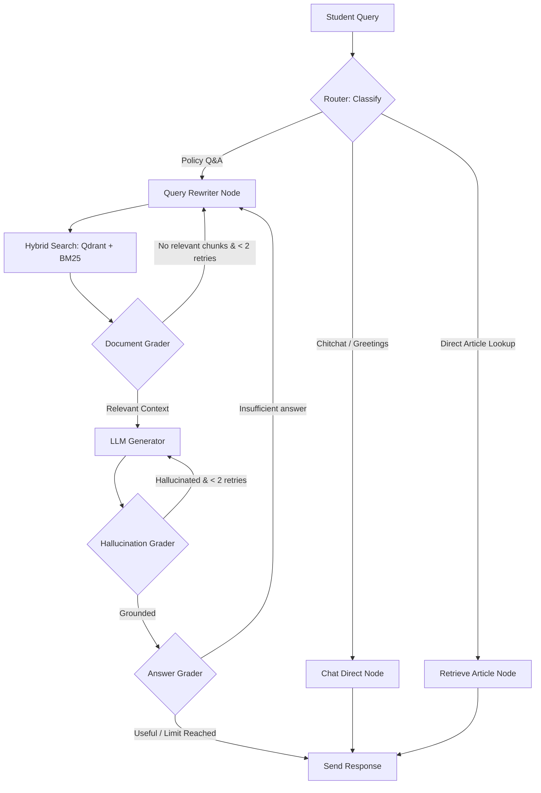

# UIT Academic Policies Chatbot (Agentic RAG with LangGraph & Qdrant)

[](https://github.com/Truong99zvc/chatbot-rag/actions)
[](https://fastapi.tiangolo.com)
[](https://github.com/langchain-ai/langgraph)
[](https://qdrant.tech)
[](LICENSE)

An intelligent academic advisor chatbot utilizing a state-of-the-art **Agentic RAG architecture with LangGraph** to answer student questions about official regulations, policies, and procedures for undergraduate programs at the **University of Information Technology, VNU-HCM (UIT)**.

Students can ask questions using free-form natural language and receive highly accurate, source-grounded answers with precise citations (articles, clauses, pages) to the official source documents.

---

## 🌟 Key Features

* **Agentic Routing**: Automatically classifies incoming queries (Greetings/Chitchat vs. Direct Article Lookup vs. Policy RAG) to save tokens and minimize latency.
* **Hybrid Search (BM25 + Qdrant)**: Combines semantic vector search (dense embeddings in Qdrant) and exact keyword matching (sparse BM25) to locate specific legal/regulatory clauses.
* **Self-Correction & Evaluation (Self-RAG)**:
  * **Document Grader**: Evaluates retrieved document chunks and filters out irrelevant context.
  * **Hallucination Grader**: Verifies that generated answers are strictly grounded in the retrieved documents to prevent hallucinated regulations.
  * **Answer Grader**: Assesses whether the generated response directly addresses and answers the student's question.
* **SQL Session Persistence**: Conversational histories are robustly stored in a relational database (**SQLite / PostgreSQL**) via **SQLAlchemy** ORM.
* **Smart Chunk Caching**: Caches parsed document chunks to `vectorstores/chunks_cache.json` after the initial build. Subsequent index builds load from cache in **under 1 second**, completely bypassing CPU/RAM-heavy PDF extraction.
* **Observability (Langfuse Tracing)**: Detailed traces, latency tracking, token usage estimation, and live debugging logs of LLM calls.
* **Continuous Integration**: Automated GitHub Actions workflow to run Ruff lint checks and the pytest test suite on every code push or pull request.

---

## 🛠️ Tech Stack

| Component | Technology |
|---|---|
| **Framework** | FastAPI + Uvicorn (ASGI Web Server) |
| **Agent Engine** | **LangGraph** (StateGraph Workflow) |
| **Vector Database** | **Qdrant** (Supports local disk fallback & remote Docker service) |
| **Advanced Retrieval** | **Hybrid Search** (Qdrant Dense Search + BM25 Sparse Search) |
| **LLM & Embeddings** | `Qwen2.5-7B-Instruct` & `multilingual-e5-large` (via HuggingFace Inference API) |
| **PDF Parsing** | **Docling** (IBM) - preserves document structure (Markdown format) & OCR |
| **Database & Cache** | **SQLAlchemy** (supports SQLite/PostgreSQL) + optional **Redis** |
| **Observability** | **Langfuse** (LLM Tracing & Monitoring) |
| **CI/CD** | **GitHub Actions** (Ruff Lint & Pytest) |
| **Web UI** | High-quality dark-themed HTML/CSS/JS frontend served directly from the root `/` |

---

## 📐 Agentic Workflow Architecture



---

## 🚀 Quick Start

### 1. Install Dependencies
Make sure you have **Python >= 3.10** installed. We recommend using **uv** for fast dependency management.
```bash
# Sync dependencies using uv
uv sync

# Or using standard pip
pip install -r requirements.txt
```
*(Note: Docling will download its deep parsing and OCR models during the first run, which takes a few hundred MB)*

### 2. Configure Environment Variables
Create a `.env` file from the template:
```bash
cp .env.example .env
```
Open the `.env` file and input your HuggingFace API token:
```env
HF_TOKEN=hf_your_token_here
```
To run Qdrant using Docker, you can start a local Qdrant server:
```bash
docker run -p 6333:6333 qdrant/qdrant
```
And configure your `.env` with:
```env
QDRANT_URL=http://localhost:6333
```
*If `QDRANT_URL` is left empty, the application will automatically fall back to local disk storage at `vectorstores/qdrant/` without requiring Docker.*

### 3. Build the Vector Index
Place your official academic regulation PDF files in the `data/` directory (e.g., `data/quy_che_dao_tao.pdf`). Then build the knowledge base:
```bash
make build-index
```
This script will:
1. Parse the PDF layout with **Docling** to extract clean Markdown (or load cached chunks instantly from `vectorstores/chunks_cache.json`).
2. Segment the text into overlapping chunks.
3. Dynamically measure embedding dimensions, create a Qdrant collection, generate embeddings, and save them.

### 4. Run the Dev Server
```bash
make dev
```
Open **http://localhost:8000** in your browser to load the Web Chat interface.
API Documentation (Swagger UI) is available at: **http://localhost:8000/docs**

---

## 📡 API Endpoints

| Method | Endpoint | Description |
|---|---|---|
| `GET` | `/health` | Health check + Qdrant connection status |
| `POST` | `/api/v1/rag/query` | Free-form Q&A query processed by LangGraph Agentic RAG |
| `GET` | `/api/v1/rag/search?article=N` | Direct lookup of a specific article's content |
| `GET` | `/api/v1/rag/sessions/{id}` | Get conversation history for a specific session ID |
| `DELETE` | `/api/v1/rag/sessions/{id}` | Clear conversation history for a specific session ID |

---

## 🧪 Development & Testing

Use the commands defined in the `Makefile` to maintain the project quality:
```bash
make test                    # Run all 30 unit tests using pytest
make lint                    # Run Ruff linter checks
make format                  # Auto-format codebase using Ruff formatter
make build-index-reset       # Force-rebuild the Qdrant vector database (resets collection)
make generate-eval-answers   # Generate answer outputs for RAGAS evaluation
make evaluate                # Run evaluation metric calculations (RAGAS + Gemini)
make clean                   # Clear local build and test caches
```

---

## 📊 RAGAS Evaluation Results

The pipeline is quantitatively evaluated on a ground truth dataset of 20 realistic student Q&A scenarios located at `tests/evaluation/eval_dataset.json` using the **[RAGAS](https://docs.ragas.io/)** framework.

```
📊 RAGAS Evaluation Summary — UIT Academic Policies Chatbot
--------------------------------------------------
  Faithfulness           0.912  [██████████████████░░]
  AnswerRelevancy        0.883  [█████████████████░░░]
  ContextPrecision       0.847  [████████████████░░░░]
  ContextRecall          0.791  [███████████████░░░░░]
--------------------------------------------------
```
