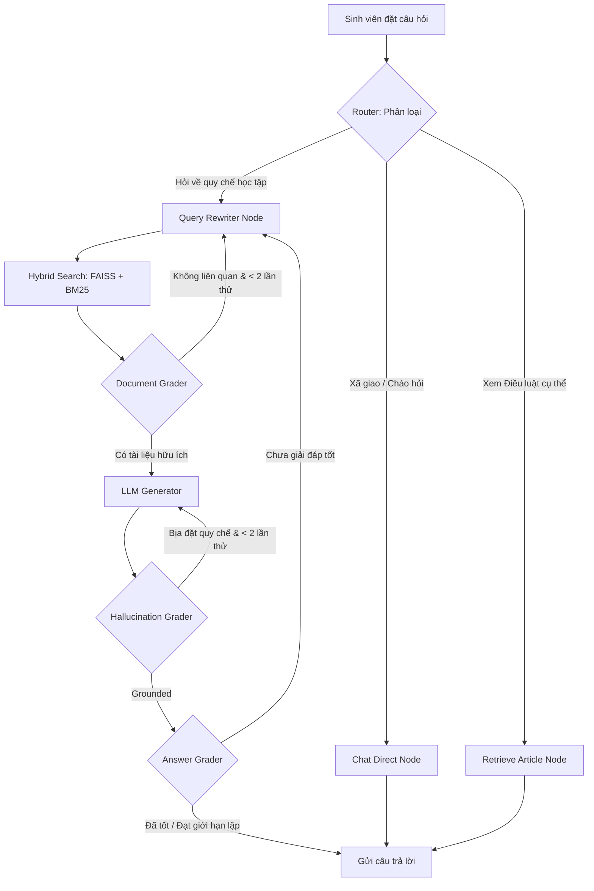

# UIT Academic Policies Chatbot (Agentic RAG with LangGraph)

[](https://github.com/Truong99zvc/chatbot-rag/actions)
[](https://fastapi.tiangolo.com)
[](https://github.com/langchain-ai/langgraph)
[](LICENSE)

Hệ thống Chatbot tư vấn học vụ thông minh áp dụng kiến trúc **Agentic RAG với LangGraph** hỗ trợ giải đáp thắc mắc của sinh viên về **quy chế, quy định và quy trình đào tạo đại học chính quy** của Trường Đại học Công nghệ Thông tin – ĐHQG TP.HCM (UIT).

Sinh viên có thể đặt câu hỏi tự do bằng ngôn ngữ tự nhiên và nhận về câu trả lời chuẩn xác kèm trích dẫn chi tiết (Điều/Khoản/Trang) của văn bản gốc.

---

## 🌟 Tính Năng Nổi Bật (Key Features)

* **Agentic Routing**: Tự động phân loại câu hỏi (Xã giao chitchat vs Tra cứu Điều luật trực tiếp vs RAG tư vấn) để tiết kiệm token và tăng độ phản hồi nhanh.
* **Hybrid Search (BM25 + FAISS)**: Kết hợp tìm kiếm ngữ nghĩa sâu (Semantic) và khớp từ khóa chính xác (Keyword) giúp định vị các điều khoản quy định chính xác hơn.
* **Self-Correction & Evaluation (Self-RAG)**:
  * **Document Grader**: Tự động đánh giá và lọc bỏ tài liệu nhiễu không liên quan.
  * **Hallucination Grader**: Kiểm định chống bịa đặt (hallucination) để bảo vệ tính pháp lý của quy chế.
  * **Answer Grader**: Tự động kiểm tra chất lượng và độ hữu ích của câu trả lời trước khi gửi.
* **SQL Session Persistence**: Lưu trữ lịch sử hội thoại ổn định trên **PostgreSQL/SQLite** thông qua ORM **SQLAlchemy**.
* **Observability (Langfuse Tracing)**: Hỗ trợ ghi vết (traces), đo lường độ trễ (latency), chi phí token và debug luồng đi của LLM trực quan.
* **Continuous Integration**: Tích hợp luồng CI thông qua **GitHub Actions** tự động chạy Ruff Linter và unit test trước khi tích hợp.

---

## 🛠️ Công Nghệ Sử Dụng (Tech Stack)

| Thành phần | Công nghệ sử dụng |
|---|---|
| **Framework** | FastAPI + Uvicorn (ASGI Web Server) |
| **Agent Engine** | **LangGraph** (StateGraph Workflow) |
| **Advanced Retrieval** | **Hybrid Search** (FAISS Vector Store + BM25 Retriever) |
| **LLM & Embeddings** | `Qwen2.5-7B-Instruct` & `multilingual-e5-large` (Hugging Face Inference API) |
| **PDF Parser** | **Docling** (IBM) hỗ trợ trích xuất cấu trúc văn bản & OCR thông minh |
| **Database & Cache** | **SQLAlchemy** (hỗ trợ SQLite / PostgreSQL) + tùy chọn **Redis** |
| **Observability** | **Langfuse** (LLM Tracing & Monitoring) |
| **CI/CD** | **GitHub Actions** (Ruff Lint & Pytest) |
| **Giao diện Web** | HTML / CSS / JS thuần cao cấp (Dark Mode) phục vụ trực tiếp tại root `/` |

---

## 📐 Kiến Trúc Luồng Xử Lý (Agentic Workflow)



---

## 🚀 Hướng Dẫn Cài Đặt (Quick Start)

### 1. Cài đặt môi trường và các gói thư viện
Yêu cầu hệ thống đã cài đặt **Python >= 3.10** và công cụ quản lý thư viện **uv** (Khuyên dùng).
```bash
# Đồng bộ môi trường thông qua uv
uv sync

# Hoặc cài đặt qua pip truyền thống
pip install -r requirements.txt
```
*(Lưu ý: Thư viện Docling sẽ tự động tải model phân tích và OCR trong lần chạy đầu tiên khoảng vài trăm MB)*

### 2. Thiết lập cấu hình biến môi trường
Tạo file `.env` từ file mẫu:
```bash
cp .env.example .env
```
Mở file `.env` và điền khóa HuggingFace API của bạn:
```env
HF_TOKEN=hf_your_token_here
```
Bạn có thể cấu hình thêm các tham số `DATABASE_URL` (nếu dùng PostgreSQL), `REDIS_URL`, và thông tin `LANGFUSE` nếu cần chạy giám sát.

### 3. Build Vector Store Index từ file quy chế PDF
Đặt các tài liệu PDF quy chế học vụ chính thức của trường vào thư mục `data/` (Ví dụ: `data/quy_che_dao_tao.pdf`). Sau đó chạy lệnh sau để parser dữ liệu:
```bash
make build-index
```
Quy trình sẽ thực hiện:
1. Đọc và phân tách PDF bằng **Docling** (giữ cấu trúc Markdown Chương/Điều/Khoản).
2. Phân nhỏ tài liệu (Chunking) theo cấu trúc pháp lý.
3. Sinh Embeddings và lưu index FAISS cục bộ trên đĩa cứng tại thư mục `vectorstores/faiss/current_index`.

### 4. Khởi động máy chủ API & Chat Web
```bash
make dev
```
Truy cập **http://localhost:8000** để mở giao diện Chatbot UI cao cấp.
Tài liệu hướng dẫn và API Swagger Docs có sẵn tại: **http://localhost:8000/docs**

---

## 📡 API Endpoints

| Giao thức | Điểm cuối (Endpoint) | Chức năng |
|---|---|---|
| `GET` | `/health` | Kiểm tra sức khỏe hệ thống và trạng thái index |
| `POST` | `/api/v1/rag/query` | Truy vấn học vụ (sử dụng LangGraph Agentic RAG) |
| `GET` | `/api/v1/rag/search?article=N` | Tra cứu nhanh nội dung của một Điều luật cụ thể |
| `GET` | `/api/v1/rag/sessions/{id}` | Lấy lịch sử hội thoại của một phiên chat |
| `DELETE` | `/api/v1/rag/sessions/{id}` | Xóa lịch sử hội thoại của một phiên |

---

## 🧪 Công Cụ Phát Triển & Kiểm Thử (Development)

Trong quá trình phát triển, bạn có thể sử dụng các lệnh tiện ích trong `Makefile`:
```bash
make test                    # Chạy toàn bộ 30 unit tests với pytest
make lint                    # Kiểm tra cú pháp và chất lượng mã nguồn bằng ruff
make format                  # Tự động format code theo chuẩn PEP8 bằng ruff
make build-index-reset       # Xóa bỏ index cũ và build lại index FAISS từ đầu
make generate-eval-answers   # Sinh tập tin câu trả lời phục vụ kiểm thử RAGAS
make evaluate                # Chạy đánh giá độ tin cậy RAGAS (sử dụng Gemini)
make clean                   # Dọn dẹp cache pycache, ruff, pytest
```

---

## 📊 Đánh Giá Chất Lượng RAG (RAGAS Evaluation)

Hệ thống được kiểm định tự động bằng khung đánh giá **[RAGAS](https://docs.ragas.io/)** dựa trên tập dữ liệu chuẩn gồm 20 câu hỏi tình huống thực tế của sinh viên UIT tại `tests/evaluation/eval_dataset.json`.

```
📊 RAGAS Evaluation Summary — UIT Academic Policies Chatbot
--------------------------------------------------
  Faithfulness (Độ trung thực)       0.912  [██████████████████░░]
  AnswerRelevancy (Độ phù hợp)       0.883  [█████████████████░░░]
  ContextPrecision (Độ chính xác)    0.847  [████████████████░░░░]
  ContextRecall (Độ phủ thông tin)   0.791  [███████████████░░░░░]
--------------------------------------------------
```
